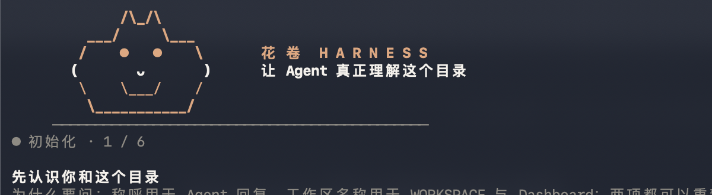
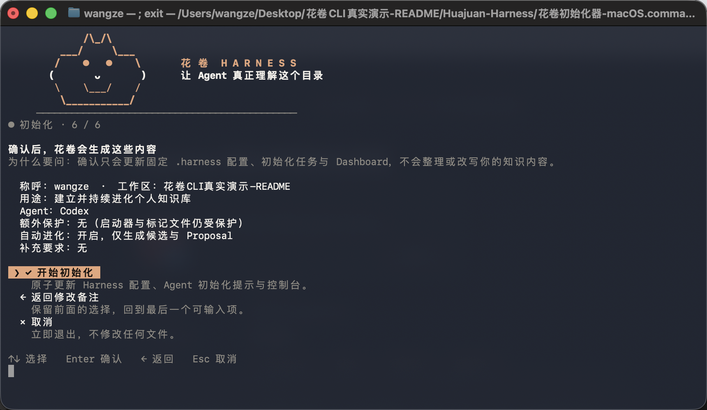
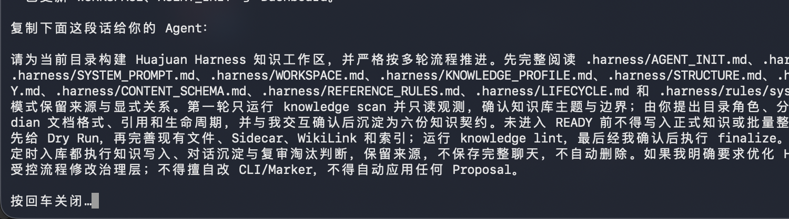
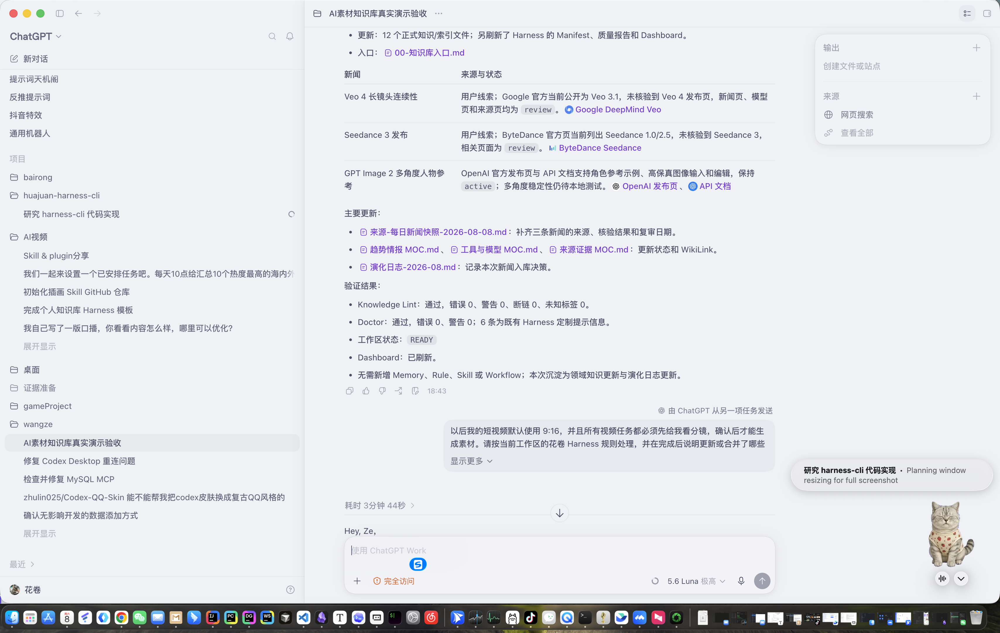
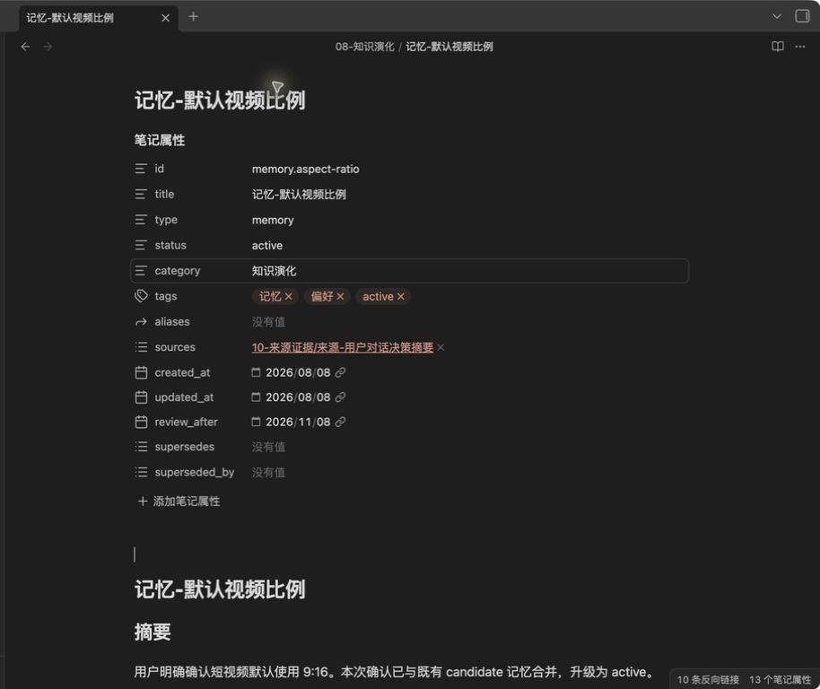
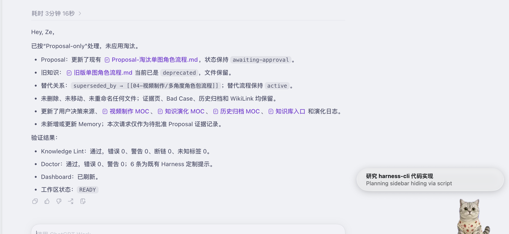
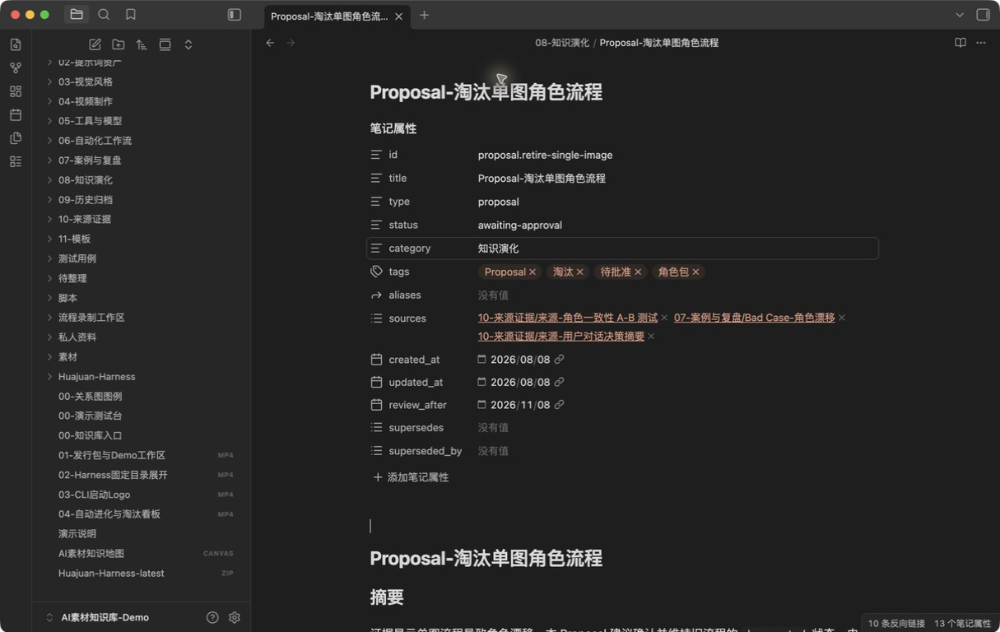
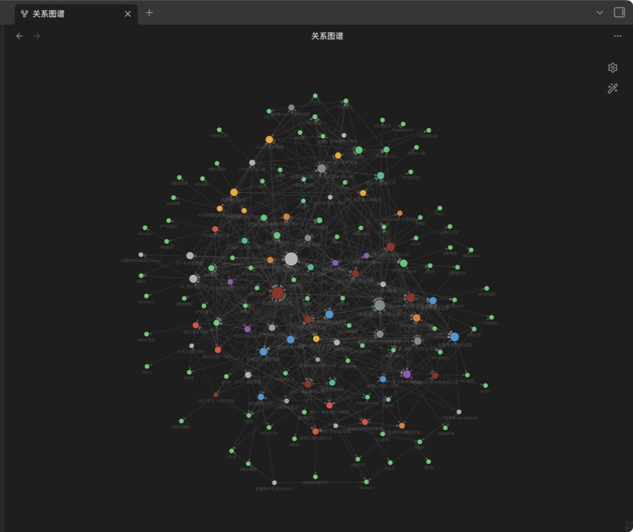

# Huajuan Harness CLI

<p align="center">
  
</p>

<p align="center">
  把任意本地目录变成一个由 Agent 持续维护、自动进化且可审阅淘汰的知识工作区。
</p>

<p align="center">
  <a href="https://github.com/wz20/huajuan-harness-cli/releases/latest">下载最新版</a>
</p>

## 从打开 CLI 到知识库自动进化

下面不是预置测试页或静态效果图，而是一条真实、完整的验收链路：在全新目录运行发布包完成安装，再用普通用户会说的话交给 Codex，连续验证自动入库、记忆更新和知识淘汰，最后在 Obsidian 检查实际文件与关系图谱。

### 1. 打开 CLI：自动识别所在工作区

把完整的 `Huajuan-Harness` 文件夹放进工作区后，双击对应系统的启动器即可。CLI 自动管理自身的一级父目录，不要求用户选择或输入路径；每个问题都会说明为什么要问，以及如何选择。

<p align="center">
  
</p>

### 2. 确认策略：只选择，不猜测

本次演示选择 Codex、开启自动进化、关闭 Proposal 自动应用。CLI 会在落盘前集中显示所有配置；除用户称呼、工作区名称和可选备注外，关键策略都通过选项确定。

<p align="center">
  
</p>

### 3. 安装完成：得到可直接发给 Codex 的话术

安装后，CLI 写入完整 `.harness`，扫描当前一级目录，并生成一段可直接复制给 Codex 的初始化话术。此时新工作区保持 `awaiting-agent / BLOCKED`，Codex 必须先观察目录、与用户确认六份知识契约并通过门禁，不能在规则尚未明确时直接整理知识。

<p align="center">
  
</p>

### 4. 自动入库：先核验、再查重、最后更新

用户只需要说：

> 帮我看看最近 AI 素材圈有什么值得关注的更新，整理进知识库。

Harness 自动完成来源核验、重复检查、分类、关系更新和质量检查。Codex 没有重复造文件，而是复用并更新 12 个现有知识与索引文件。Veo 4 和 Seedance 3 因未找到对应官方发布证据保持 `review`；GPT Image 2 有官方发布页和 API 文档支持，保持 `active`。随后 Knowledge Lint、Doctor 和工作区 `READY` 状态全部通过。

<p align="center">
  
</p>

### 5. 对话记忆：合并已有偏好，而不是重复创建

用户只需要说：

> 以后做短视频默认用 9:16，先把分镜给我看看。

Agent 会自动查找已有记忆、判断是否合并，将默认比例从 `candidate` 合并升级为 `active`，同时更新“先分镜再生成”、视频流程、检查清单、来源页、MOC 与演化日志，没有新增重复 Memory。

<p align="center">
  
</p>

### 6. 知识淘汰：只生成待审批 Proposal，不擅自删除

用户只需要说：

> 单图角色的方案我不想再用了，后面改成多角度角色包吧。

Agent 会自动判断这是一次淘汰意图，但不会擅自删除。它只更新 `awaiting-approval` Proposal；旧知识、Bad Case、A/B 测试证据和 WikiLink 全部保留，没有移动、重命名或删除文件；替代方案继续指向 active 的多角度角色包流程。

<p align="center">
  
</p>

<p align="center">
  
</p>

本轮实测最终结果：70 个受管 Markdown，Frontmatter 与 Sidecar 覆盖率 100%，断链 0，未知标签 0；Knowledge Lint 和 Doctor 均无错误，工作区保持 `READY`。

### 7. Obsidian 最终效果：知识不是文件堆，而是可追踪的关系网

三轮真实任务完成后，新增或更新的知识、来源、流程、记忆、案例与淘汰提案仍通过 WikiLink 连接。下面是同一 AI 素材 Demo 工作区的实际 Obsidian 全局关系图，而不是为了 README 单独生成的静态示意图。

<p align="center">
  
</p>

## 它解决什么问题

普通文件夹交给 Agent 后，常见结果是目录越建越乱、同类内容重复、来源丢失、对话经验没有沉淀，过期内容也没人处理。

Huajuan Harness CLI 不替用户预设知识库结构。它提供一套强制治理脚手架，让 Agent 必须先理解工作区、与用户确认规则，再开始干活：

- 明确知识库主题和边界；
- 明确目录结构与文件职责；
- 明确分类、标签和命名标准；
- 明确 Markdown、素材 Sidecar 与 Obsidian 格式；
- 明确来源、引用和知识关系；
- 明确更新、复审、淘汰与记忆规则。

规则没有明确前，工作区保持 `BLOCKED`；六份知识契约、质量检查和 Doctor 全部通过后，才会进入 `READY`。

## Huajuan 的特色

### 下载即用，不选路径

把完整 `Huajuan-Harness` 文件夹放进知识库，启动器自动作用于它的一级父目录。无需安装全局 CLI，也不要求用户输入文件路径。

### 不是固定模板，而是元规则

Huajuan 不硬编码“AI 素材应该有哪些目录”。Agent 会扫描真实内容，提出结构、分类和格式方案，与用户确认后沉淀为当前知识库自己的规则。

### 多 Agent 共用一套 Harness

内置 Claude Code、Codex、Cursor、Trae、WorkBuddy 和通用 Agent 适配。工作区规则、Skills、Workflows、MCP 声明、Memory、Bad Case 与 Evolution Proposal 全部保存在 `.harness`，不污染全局配置。

### 真正面向知识库质量

- Markdown 使用 YAML Frontmatter；
- 内部关系使用 Obsidian WikiLink；
- 图片、视频、音频等非 Markdown 文件使用同名 `.huajuan.md` Sidecar；
- 每次写入先分类、查重，再决定新建、合并或更新；
- 来源目录、正式知识目录和素材目录都受格式约束；
- 索引、失效链接、未知标签和缺失 Sidecar 可确定性检查。

### 自动进化，但不失控

每次任务和定时采集结束后，Agent 都要判断：无需沉淀、新增、合并、更新、复审、淘汰候选，或升级为 Rule / Skill / Workflow。

Proposal 永不自动应用，资产永不自动删除；高风险文件操作、保护路径写入和 MCP 权限扩大都必须先确认。

### 花卷看板

离线 Dashboard 提供概览、知识库门禁、知识关系、Harness 资产、进化中心和 Doctor 六个视图。它可以查看状态、筛选数据、复制 Agent 指令与 CLI 命令、导出快照，但不会执行 Shell 或修改工作区。

## 快速开始

### 1. 下载

[直接下载最新版 ZIP](https://github.com/wz20/huajuan-harness-cli/releases/latest/download/Huajuan-Harness-latest.zip)

需要 Node.js 20 或更高版本。

### 2. 放入工作区

解压后，把完整 `Huajuan-Harness` 文件夹放进知识库根目录，不要只复制其中某个启动脚本。

```text
我的知识库/                       ← Huajuan 实际管理的工作区
├── 技术学习/
├── 素材/
├── 项目/
└── Huajuan-Harness/             ← 下载并解压得到的完整文件夹
    ├── 花卷初始化器-macOS.command
    ├── 花卷初始化器-Windows.cmd
    └── 花卷初始化器-Linux.sh
```

第一次启动后，Harness 会安装到工作区根目录：

```text
我的知识库/
├── .harness/                    ← 工作区治理内核
└── Huajuan-Harness/             ← 便携安装包，不会被计入知识扫描
```

### 3. 运行启动器

- macOS：双击 `花卷初始化器-macOS.command`，也可以双击应用版本；
- Windows：双击 `花卷初始化器-Windows.cmd`；
- Linux：运行 `花卷初始化器-Linux.sh`。

Windows 请先完整解压 ZIP，不要从压缩包预览里运行，也不要只复制 `.cmd` 文件。若系统显示安全提醒，确认文件来自本仓库后可选择“更多信息 → 仍要运行”；启动器会直接提示缺少 Node.js、版本过低或文件未完整解压，不会静默闪退。

启动器只允许输入用户称呼、工作区名称和可选备注。核心用途、主要 Agent、保护路径和自动进化全部通过方向键与 Space 选择。

### 4. 把最终指令交给 Agent

向导完成后会输出一段可直接复制的初始化指令。把它发给所选 Agent，Agent 将按以下过程继续：

```text
只读扫描
  → 确认主题与边界
  → 确认六份知识契约
  → 提交 Dry Run
  → 迁移或补齐现有内容
  → Knowledge Lint
  → Doctor
  → 用户最终确认
  → READY
```

`AGENT_INIT.md` 是多轮初始化协议。Agent 不应该在第一次回复中直接生成一堆目录并宣布完成。

## 六份知识契约

| 文件 | 必须明确的内容 |
|---|---|
| `KNOWLEDGE_PROFILE.md` | 主题、使命、边界、知识对象和成功标准 |
| `STRUCTURE.md` | 目录角色、默认写入位置、索引与归档规则 |
| `TAXONOMY.md` | 主分类、受控标签、别名与分类顺序 |
| `CONTENT_SCHEMA.md` | 文档类型、Frontmatter、正文格式和 Sidecar |
| `REFERENCE_RULES.md` | 来源、WikiLink、关系证据、冲突与不确定项 |
| `LIFECYCLE.md` | 准入、更新、合并、复审、淘汰、对话和定时入库 |

## 常用命令

在知识库根目录运行：

```bash
node .harness/.huajuan.mjs                 # 打开选项式主菜单
node .harness/.huajuan.mjs status          # 查看工作区状态
node .harness/.huajuan.mjs knowledge status
node .harness/.huajuan.mjs knowledge scan  # 刷新文件清单与指纹
node .harness/.huajuan.mjs knowledge lint  # 检查知识质量
node .harness/.huajuan.mjs finalize        # 通过全部门禁后进入 READY
node .harness/.huajuan.mjs doctor
node .harness/.huajuan.mjs dashboard --open
node .harness/.huajuan.mjs prompt          # 再次输出 Agent 指令
node .harness/.huajuan.mjs uninstall       # 选项式导出与安全卸载
```

## 安全边界

- `.huajuan.mjs` 与 `.huajuan.json` 是运行内核，普通工作任务不能修改；
- 用户明确要求优化 Harness 时，允许按范围、风险、验证和回滚受控修改治理层；
- 保护路径默认只读；
- Harness 不保存 MCP 密钥，也不修改 Agent 全局配置；
- 自动进化只能产生候选、Bad Case 和 Proposal；
- 淘汰使用 `deprecated + superseded_by` 保留历史，不等于删除；
- 文件系统中的 Markdown 和素材始终是唯一真实数据源。
